  

## 📝 About Me
I'm a Computer Science student building practical AI systems, with a focus on agentic AI, applied AI, and ML backend engineering. I've written a review paper, Edge AI for Resource-Constrained Devices, covering TinyML and on-device inference. I favor clear, testable engineering and I'm open to collaborating on ML and data-driven projects.  

## 🛠️ Languages and Tools

 

  
  

## 🚀 Stats

  
  

## 🤝 My Contributions

<picture>
  <source media="(prefers-color-scheme: dark)" srcset="https://raw.githubusercontent.com/ChijiokeOkorji/ChijiokeOkorji/output/github-contribution-grid-snake-dark.svg">
  <source media="(prefers-color-scheme: light)" srcset="https://raw.githubusercontent.com/ChijiokeOkorji/ChijiokeOkorji/output/github-contribution-grid-snake.svg">
  
</picture>

  

----
